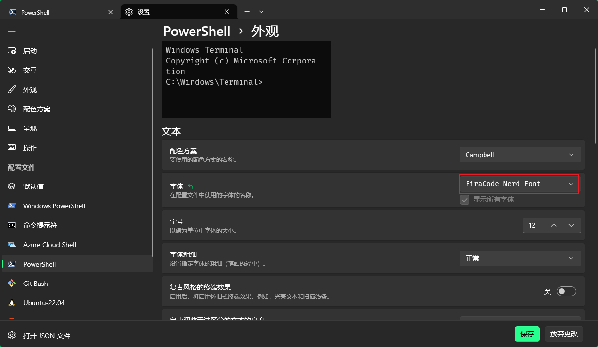
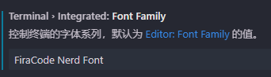

# 在Scoop中已经安装了starship

编辑 `$PROFILE` 文件
```shell
code $PROFILE
```

添加内容
```
Invoke-Expression (&starship init powershell)
```

## 使用字体

需要在终端设置中 配置字体 否则`emoji` 无法正常显示



`vscode` 同理 需要在配置中设置相应的字体




## 简化`pnpm `输入 

```shell
# 用记事本打开配置文件
notepad $profile.AllUsersAllHosts

# 设置alias
set-alias -name pn -value pnpm
```
