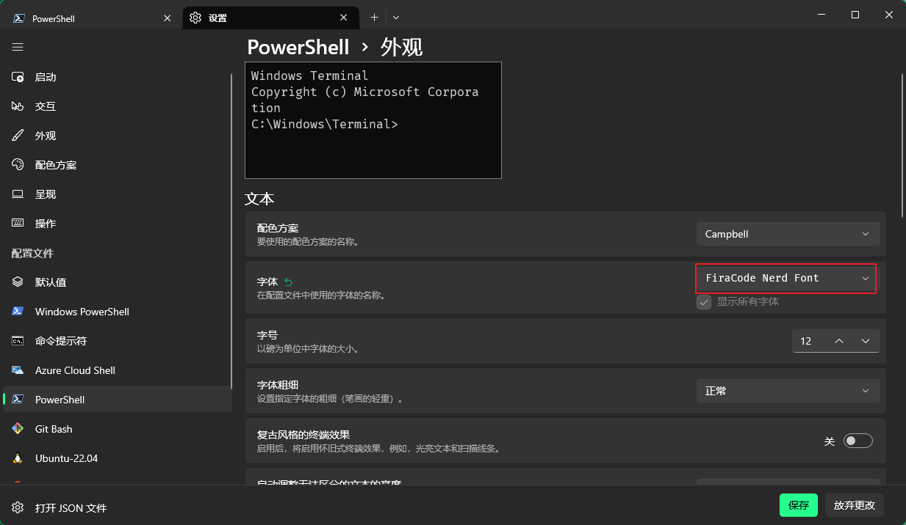
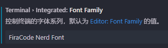

# 在Scoop中已经安装了starship

编辑 `$PROFILE` 文件
```shell
code $PROFILE
```

添加内容
```
Invoke-Expression (&starship init powershell)
```

## 使用字体

需要在终端设置中 配置字体 否则`emoji` 无法正常显示



`vscode` 同理 需要在配置中设置相应的字体


