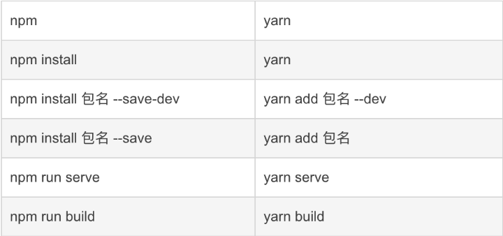

# bash & shell 相关

## npm 及 yarn 命令 对比



## yarn源配置

```bash
yarn config get registry #查看当前源

yarn config set registry https://registry.npm.taobao.org #更换源
```

## 常用命令

```bash
# 使用资源管理器 打开当前目录
explorer .
# 使用vscode 打开当前目录
code .
```

## npm yarn 遇到的问题

### 使用`npx @dcloudio/uvm alpha`命令升级时 遇到的报错

```bash
npm WARN config global `--global`, `--local` are deprecated. Use `--location=global` instead.
````

找到`nodejs`的安装目录 修改`npm.cmd`和`npx.cmd`中`prefix-g` 改为 `prefix --location=global`
