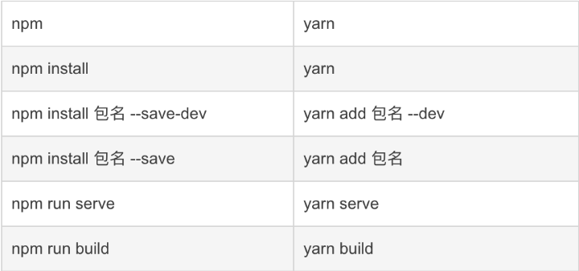

# bash & shell 相关

## npm 及 yarn 命令 对比



## 源配置


```bash
# yarn
yarn config get registry #查看当前源

yarn config set registry https://registry.npm.taobao.org #更换源

# npm
npm get reistry
npm config set registry https://registry.npm.taobao.org
```

## 使用 `nrm` 管理源

``` bash
npm install -g nrm  # node 某版本之后 内置

nrm current  # 查看当前使用的源

nrm ls  # 查看可用源

nrm use taobao # 切换源

nrm test  测速

nrm add <registry> <url>  #添加一个源   registry为源名，url为源地址

nrm del  <registry>  #删除源
```

## 常用命令

```bash
# 使用资源管理器 打开当前目录
explorer .
# 使用vscode 打开当前目录
code .
```

## npm yarn 遇到的问题

### 使用`npx @dcloudio/uvm alpha`命令升级时 遇到的报错

```bash
npm WARN config global `--global`, `--local` are deprecated. Use `--location=global` instead.
````

找到`nodejs`的安装目录 修改`npm.cmd`和`npx.cmd`中`prefix-g` 改为 `prefix --location=global`

| npm | yarn | 说明 |
| ---- | ---- | ---- |
|`npm ls -g`| `yarn global list`| 查看全局安装的包 |

## 新安装的bash 无法使用方向键控制

``` bash
# ~/.bashrc

alias taro='winpty taro.cmd' # 需要注意 = 附近不能有空格
alias vue='winpty vue.cmd' # 已经不常使用
```
