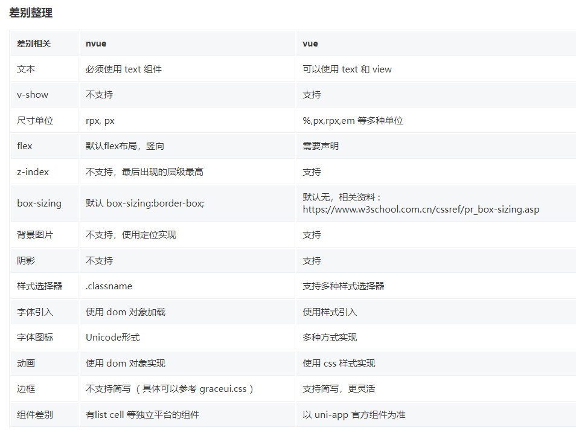
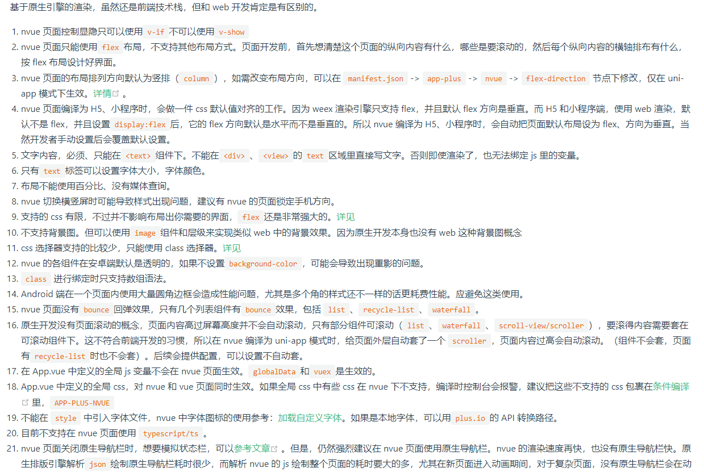

# uniapp 相关笔记

## 创建 `typescript` 开发的工程

```bash
npx degit dcloudio/uni-preset-vue#vite-ts my-vue3-project
```

## `nvue` 页面说明
<!--  -->
### 

<!--  -->
### 

## nvue 页面与 vue页面 区别点

||vue|nvue|
|---|---|---|
|事件|`preventDefault` 和 `stopPropagation`|只有 `stopPropagation`|
|`renderjs`|支持|不支持|


## 透明页面

## 动态组件`component`

在`uniapp`中 `vue2`版本 `is`必须传递`string`类型, 否则云打包无法正常渲染
